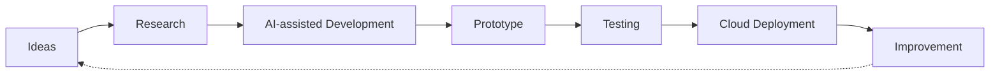

<h1 align="center">Hi 👋, I'm Shubham Mankar</h1>

<h3 align="center">AI Engineer • Generative AI Builder • B.Tech Computer Engineering Student</h3>

  I build AI-powered applications, agents, developer tools, and cloud-based prototypes—turning ideas into working software through rapid experimentation.

  
  
  
  
  

## About Me

- 🎓 B.Tech Computer Engineering student and aspiring AI engineer
- 🧠 Interested in AI, Generative AI, Agentic AI, RAG, MCP, LLMs, and automation
- 🛠️ Building AI agents, developer tools, and experimental products
- ☁️ Exploring AWS Bedrock, IBM watsonx.ai, IBM Granite, IBM Cloud, cloud architecture, and DevOps
- 💡 Strongly motivated by turning ideas into useful working prototypes
- 🤝 Open to internships, open-source contributions, research, and collaborations

> [!NOTE]
> I focus on learning by building real projects, experimenting with AI tools, and converting ideas into working prototypes.

## What I Build

| Area | What I explore |
| :--- | :--- |
| 🤖 AI agents | Goal-driven assistants and agentic workflows |
| 🧠 Multi-model platforms | Interfaces that bring multiple foundation models together |
| 🧰 AI developer tools | Tools that support coding, analysis, validation, and repair |
| ☁️ Cloud AI applications | AI prototypes connected to managed cloud services |
| ⚙️ Automation systems | Repeatable workflows that reduce manual effort |
| 🚀 Rapid prototypes | Proof-of-concept products built to test ideas quickly |

## Technology Stack

### Languages

### AI & LLMs

### Cloud & DevOps

### Backend & APIs

### Frontend

### Tools

## Featured Projects

| Project | Description | Links |
| :--- | :--- | :---: |
| **Sketch2TikZ AI** | Converts sketches, images, PDFs, and natural-language prompts into editable LaTeX TikZ diagrams using IBM watsonx.ai, IBM Granite, FastAPI, and automated validation and repair. | [Repository](https://github.com/Shubham56277/Sketch2TikZ-AI) · [Live Demo](https://sketch2tikz.vercel.app/) |
| **Multi-Model AI Chat Platform** | A unified AWS Bedrock interface with model switching, latency statistics, file uploads, retry handling, and developer settings. | In development |
| **Startup Blueprint Generator** | Uses IBM Granite, RAG, IBM Cloud, and watsonx Orchestrate to create business models, competitor analysis, budgets, funding options, and go-to-market strategies. | In development |
| **AI Coding Agent** | An experimental assistant for generating, analyzing, repairing, and improving code through agentic workflows. | In development |
| **Real-Time Voice Intelligence Research** | Experiments with low-latency voice cloning, accent handling, live audio processing, and Discord integration. | Research project |
| **Linux ATM Management System** | A terminal-based banking simulation built with Linux and foundational systems-programming concepts. | [Repository](https://github.com/Shubham56277/linux-atm-team-project) |
| **Student Management System** | A beginner-friendly C project for managing student records and basic academic information. | [Repository](https://github.com/Shubham56277/Student-Management-System-C-Language-) |

## How I Learn & Build

## Current Focus

`Agentic AI` · `Generative AI` · `RAG` · `MCP` · `Multi-agent systems` · `AI coding assistants` · `AWS Bedrock` · `IBM watsonx.ai` · `IBM Granite` · `Cloud architecture` · `DevOps fundamentals` · `Open source`

## GitHub Statistics

  
  

  

  

<!-- GitHub statistics reflect public activity only; private repositories and contributions may not appear. -->

> [!TIP]
> GitHub statistics are generated from public account activity and public repositories, so they may take time to update.

## Learning Roadmap

- [ ] Strengthen Python and backend development
- [ ] Learn Docker and CI/CD
- [ ] Build production-ready AI agents
- [ ] Improve cloud deployment knowledge
- [ ] Contribute to open-source projects
- [ ] Learn scalable AI system design
- [ ] Explore Kubernetes after mastering Docker fundamentals

## Connect With Me

  
  
  
  

  ⭐ If you find my projects useful, consider starring the repositories and connecting with me.

